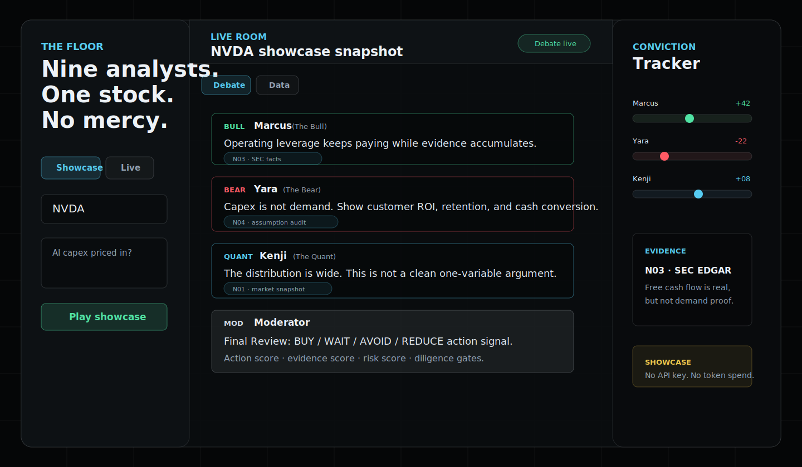

# The Floor

Five analysts. One stock. No mercy.

[](https://github.com/OAOWOuO/The-Floor/actions/workflows/ci.yml)

[Open the hosted showcase](https://the-floor.onrender.com/) · [Deploy your own on Render](https://render.com/deploy?repo=https://github.com/OAOWOuO/The-Floor)



The Floor is a research-first live AI trading-room debate app. A user enters a listed ticker, the server resolves it, fetches market/profile/stat/disclosure evidence, builds a normalized research packet, asks OpenAI to synthesize analyst priors, then streams a shared multi-agent debate over SSE. The analysts debate from the same evidence packet, cite source chips, and update conviction after every turn.

This is educational analysis only. It is not financial advice, not a stock recommendation system, and not a price prediction tool.

## What changed

- Real research mode is the default for self-hosted Live deployments.
- The public UI is split into `Showcase` and `Live` tabs.
- Showcase mode runs saved replay packets for `NVDA`, `MSFT`, `TSLA`, and `AMD` with no API key or token spend.
- Live mode is for self-hosted or private deployments with an OpenAI API key.
- The room shows visible research stages before debate begins.
- The center room includes a `Data` tab with market snapshot, key stats, disclosures, evidence cards, and the raw research packet.
- The debate is blocked until the research packet passes the minimum evidence threshold.
- Follow-up chat reuses the same research packet, analyst priors, and transcript.
- Conviction scores initialize from synthesis and move after every analyst turn.

## Data sources

- `yahoo-finance2` server-side for ticker search, quotes, chart data, profile, financial data, key statistics, earnings, and Yahoo `secFilings` where available.
- SEC EDGAR enrichment is attempted for US-style tickers; Data tab SEC facts include fiscal period and period-end labels when available.
- OpenAI Responses API is used for research synthesis, debate planning, moderator synthesis, and follow-up routing.

If coverage is too weak, the app shows an insufficient-data state instead of faking a debate.

## Run real research mode

```bash
npm install
export OPENAI_API_KEY="your_key"
export OPENAI_MODEL="gpt-5.4-mini"
npm run dev
```

Then open:

```text
http://localhost:3000
```

For Render/Railway, fork the repo, set `HOST=0.0.0.0`, and configure `OPENAI_API_KEY` in the service environment. The public hosted demo does not collect visitor API keys.

Fast path:

1. Click [Deploy your own on Render](https://render.com/deploy?repo=https://github.com/OAOWOuO/The-Floor).
2. Add `OPENAI_API_KEY` in the Render service environment.
3. Deploy and verify `/api/health` reports `"liveResearch": true`.

Optional environment variables:

```bash
export OPENAI_RESEARCH_MODEL="gpt-5.4-mini"
export OPENAI_RESEARCH_REASONING="medium"
export OPENAI_DEBATE_REASONING="low"
export FLOOR_DEBATE_MS="90000"
export SEC_USER_AGENT="The Floor contact@example.com"
export MAX_FOLLOWUPS_PER_SESSION="8"
export MAX_FOLLOWUP_BODY_BYTES="8192"
export RATE_LIMIT_DEBATE_MAX="20"
export RATE_LIMIT_FOLLOWUP_MAX="60"
```

## Showcase mode

The public hosted site defaults to Showcase mode. It demonstrates the live-room mechanics with saved replay packets without spending API tokens or accepting user API keys.

The legacy explicit URL still works:

```text
http://localhost:3000/?static=1
```

Showcase mode uses `public/showcases/replays.json` and should not be confused with live research mode.

## Production posture

- The hosted public demo does not accept browser-submitted API keys.
- OpenAI keys belong in server-side environment variables only.
- Basic security headers are sent for static files, JSON APIs, and SSE streams.
- Debate and follow-up routes have lightweight in-memory rate limits for self-hosted deployments.
- Follow-up bodies and per-session follow-up counts are capped to prevent accidental abuse.
- `/api/health` exposes deployment capabilities so the UI can avoid pretending Live mode is available when no server key is configured.
- See [SECURITY.md](SECURITY.md) before turning Live mode into a public, server-funded product.

## API

- `GET /api/health` returns `{ "ok": true, "build": ..., "capabilities": ... }` so deployment health, Render commit metadata, and hosted live-mode availability can be checked.
- `GET /api/debate?ticker=MSFT&question=...` streams SSE events:
  - `session`
  - `research_stage`
  - `research_packet_summary`
  - `typing`
  - `message`
  - `conviction`
  - `complete`
  - `error`
- `POST /api/followup` sends a grounded follow-up after the Moderator wrap.

## Scripts

```bash
npm run check
npm run test
npm run smoke
```

`npm run smoke` uses fixture market data and OpenAI mock mode so it can verify the full SSE/follow-up contract without spending tokens.

GitHub Actions runs these checks on pushes and pull requests.

## Known limitations

- Yahoo and SEC coverage differs across exchanges and non-US symbols.
- SEC enrichment is best effort and not required for non-US tickers.
- Debate quality depends on `OPENAI_API_KEY` and model availability.
- No database or authentication yet; sessions are in-memory.
- The app avoids price targets, buy/sell/hold calls, and personalized advice by design.
